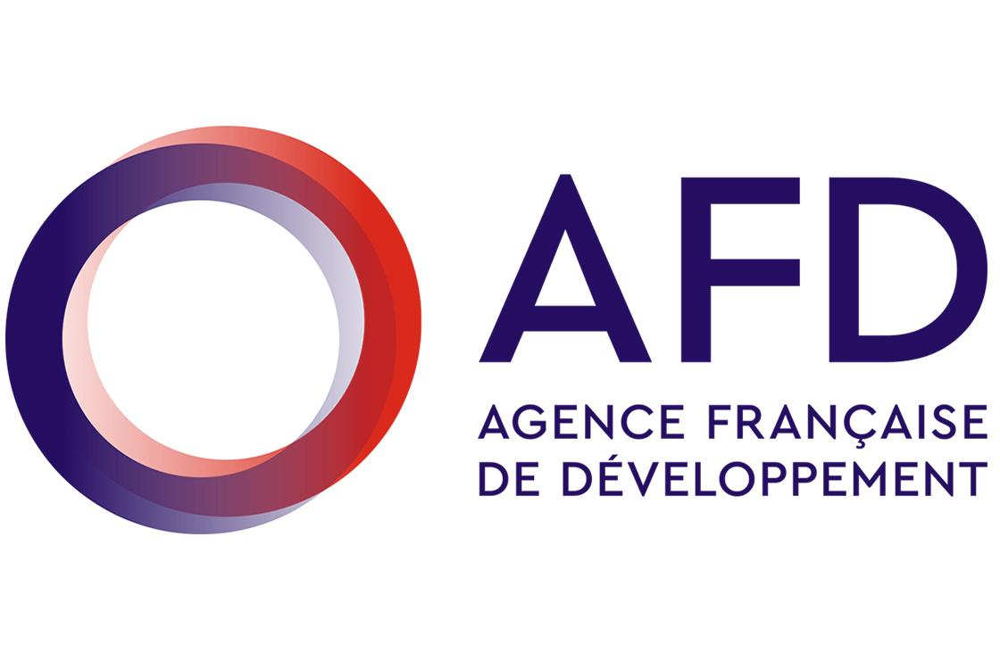

## Data-Challenge-JDS-2018 - Equipe STORM

Prédiction la consommation électrique horaire sur une semaine. 

### Objectif
Le but de ce challenge est de prévoir la **consommation électrique** de l’île d'Ouessant à 8 jours, en s’aidant des données suivantes : 
 
  * un an de données de consommation historiques, à la **maille horaire** (*conso_train.csv*), 
  * un an de données météorologiques à la **maille tri-horaire**, issues de la proche station météorologique de Brest (*meteo_train.csv*), 
  * une semaine de données météorologiques à la **maille tri-horaire**, issues de la même station et faisant office de prédiction météorologique (*meteo_prev.csv*). 

  
### Data description 
The data folder `/datasets/` contains the following files: 

* `conso_train.csv` = la consommation sur la période d'entrainement (1 an du 13/09/2015 au 13/09/2016) ;
* `meteo_train.csv` = l'historique météo sur la période d'entrainement ;
* `meteo_prev.csv` = l'historique météo pour la semaine à prédire (considérée comme une prédiction météo) ;
* `sample_solution.csv` = un fichier de solution qui vous permet de voir la forme de la solution attendue.

Predictions are saved in the csv file: `storm.csv` & `storm_ts.csv`

### Modeling 
For modeling purposes, we make use of the *Automated Machine Learning* Functionality of [H2o](https://www.h2o.ai) AutoML which trains and cross-validates a Random Forest, an Extremely-Randomized Forest, a random grid of Gradient Boosting Machines (GBMs), a random grid of Deep Neural Nets, and then trains a Stacked Ensemble using all of the models.

Given that `2016-09-13 0:00` is included in the train data, we set the first future prediction date to `2016-09-13 1:00

### Solution Output

* `Storm_JDS2018.Rmd` = Contains all the R codes needed for reproducibility ;) 
* `Storm_JDS2018.html` = Output of RMarkdown in html format. 

#### Acknowledgement  

* Special thanks to my former colleagues: 
  + Benjamin Quemener | Responsable Data Analytics, SNCF
  + Sonia Pelloux | Chef de projets Innovation & Recherche, SNCF
  
for their valuable comments and suggestions.  

* Special thanks to the [H2o.ai](https://www.h2o.ai/h2o/) team for providing an open-source AutoML functionality. 

#### CONTACT

Please feel free to fork and contribute to improving this algorithm :) Have fun!! Cheers! ;) 

You can follow me on {width=50px}  [PMarteyAddo](https://twitter.com/PMarteyAddo)

{width=200px}

