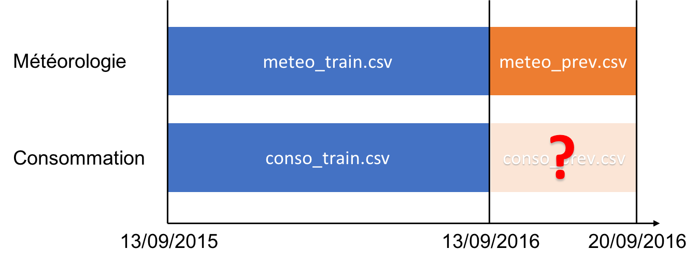

Le **Data Challenge** organisé par le "groupe des Jeunes Statisticien.ne.s" est une compétition ouverte à tous visant à étudier des jeux de données mis à disposition par de grandes entreprises ou des entités publiques. 

Le but de ce challenge est de prévoir la **consommation électrique** de l’île d'Ouessant à 8 jours, en s’aidant des données suivantes : 
 
  * un an de données de consommation historiques, à la **maille horaire** (*conso_train.csv*), 
  
  * un an de données météorologiques à la **maille tri-horaire**, issues de la proche station météorologique de Brest (*meteo_train.csv*), 
  * une semaine de données météorologiques à la **maille tri-horaire**, issues de la même station et faisant office de prédiction météorologique (*meteo_prev.csv*). 



```{r setup, include=FALSE}
knitr::opts_chunk$set(
	echo = TRUE,
	message = FALSE,
	warning = FALSE
)
```


# Introduction 

This workflow is organised as follows: the loading packages, data preparation, importing data. Next, we provide some visualisations for insights as exploration phase. We prepare data for modeling and then  present a summary of the predictive model. Finally, we obtain predictions and export output as required.

# Loading Packages, Reading and loading data

```{r results='hide', message=FALSE, warning=FALSE}
# Load libraries
library(h2o)        # Awesome ML Library
library(timetk)     # Toolkit for working with time series in R
library(tidyquant)  # Loads tidyverse, financial pkgs, used to get data
library(keras)
library(lime)
library(rsample)
library(recipes)
library(yardstick)
library(corrr)
library(forcats)
library(highcharter)
library(janitor)
library(readr)

# Initialise H2o and java 8 
Sys.setenv(JAVA_HOME="/Library/Java/JavaVirtualMachines/jdk1.8.0_152.jdk/Contents/Home")
suppressMessages(h2o.init(max_mem_size = "6g"))
h2o.no_progress()

```

```{r}
# Import data
library(readr)
conso_train <- read_delim("datasets/conso_train.csv", ";", escape_double = FALSE, trim_ws = TRUE)
meteo_train <- read_delim("datasets/meteo_train.csv", ";", escape_double = FALSE, trim_ws = TRUE)
meteo_prev <- read_delim("datasets/meteo_prev.csv", ";", escape_double = FALSE, trim_ws = TRUE)

dim(meteo_train)
dim(meteo_prev)
dim(conso_train)


glimpse(conso_train)
summary(conso_train)

```

# Data Prepare and Clean up

```{r}
## Prepare and Clean up data

# Clean Meteo train data 
meteo_train_edited <- meteo_train %>% 
  janitor::clean_names() %>% 
  mutate(date_utc= dmy_hm(date_utc)) 
meteo_train_ts <- timetk::tk_xts(meteo_train_edited)

# Clean Meteo train data 
meteo_prev_edited <- meteo_prev %>% 
  janitor::clean_names() %>% 
  mutate(date_utc= dmy_hm(date_utc)) 
meteo_prev_ts <- timetk::tk_xts(meteo_prev_edited)

# Clean Conso train data 
conso_train_ts <- timetk::tk_xts(conso_train)
```

## Exploration
```{r}

## Plots Conso  Puissance

# Plot Conso Puissance 
#hchart(conso_train_ts, name = "Puissance", color = "#B71C1C")
hc <- highchart(type = "stock") %>% 
  hc_title(text = "Charting Puissance against time") %>% 
  hc_subtitle(text = "Data on conso") %>% 
  hc_add_series(conso_train_ts$puissance, name = "Puissance")
hc

```


```{r}
# Plot all series => Conso & Meteo  
hc <- highchart(type = "stock") %>% 
  hc_title(text = "Charting some variables") %>% 
  hc_subtitle(text = "Data from conso and meteo") %>% 
  hc_add_series(meteo_train_ts$t_c, name = "t_c") %>% 
  hc_add_series(meteo_train_ts$p_hpa, name = "p_hpa") %>% 
  hc_add_series(meteo_train_ts$hr_percent, name = "hr_percent") %>% 
  hc_add_series(meteo_train_ts$p_ros_e_c, name = "p_ros_e_c") %>% 
  hc_add_series(meteo_train_ts$visi_km, name = "visi_km") %>% 
  hc_add_series(meteo_train_ts$vt_moy_km_h, name = "vt_moy_km_h") %>% 
  hc_add_series(meteo_train_ts$vt_raf_km_h, name = "vt_raf_km_h") %>% 
  hc_add_series(meteo_train_ts$vt_dir, name = "vt_dir") %>% 
  hc_add_series(meteo_train_ts$rr_3h_mm, name = "rr_3h_mm") %>% 
  hc_add_series(meteo_train_ts$neige_cm, name = "neige_cm") %>% 
  hc_add_series(meteo_train_ts$nebul_octats, name = "nebul_octats") %>% 
  hc_add_series(conso_train_ts$puissance, name = "puissance") 
hc
```

## Augment Time Series signature

Augment Time Series signature and prepare conso train data 

```{r}
########## Conso Train ###############
# Starting point
conso_train_ts_tbl <- conso_train  # %>%  glimpse()

# AUGMENT TIME SERIES SIGNATURE
# Augment time series signature (adds data frame columns)
conso_train_ts_tbl_aug <- conso_train_ts_tbl %>%
  tk_augment_timeseries_signature() 

#conso_train_ts_tbl_aug %>% glimpse()

# Prep Conso Data 
conso_train_ts_tbl_clean <- conso_train_ts_tbl_aug %>%
  mutate_if(is.factor, factor, ordered = FALSE) %>%
  select(-ends_with(".num"),-ends_with(".lbl"),-ends_with(".iso"))

conso_train_ts_tbl_clean %>% glimpse()
```

Augment Time Series signature and prepare meteo train & prevision data 

```{r}
########## Meteo Train & Prev ###############
meteo_train_ts_tbl_clean <- meteo_train_edited %>% 
  tk_augment_timeseries_signature()%>%
  mutate_if(is.factor, factor, ordered = FALSE) %>%
  select(-ends_with(".num"),-ends_with(".lbl"),-ends_with(".iso"))

meteo_prev_ts_tbl_clean <- meteo_prev_edited %>% 
  tk_augment_timeseries_signature()%>%
  mutate_if(is.factor, factor, ordered = FALSE) %>%
  select(-ends_with(".num"),-ends_with(".lbl"),-ends_with(".iso")) 

meteo_train_ts_tbl_clean %>% glimpse()
```

```{r}
meteo_prev_ts_tbl_clean %>% glimpse()
```

# Train and test data

```{r}
library(data.table)
train_data_tbl <- left_join(conso_train_ts_tbl_clean, meteo_train_ts_tbl_clean, by = c("year","month","day","hour"))

future_dates <- data.table(
  date = seq(ymd_hm("2016-09-13 0:00"), ymd_hm("2016-09-21 0:00"), by = "hour")
   ) %>%
  tk_augment_timeseries_signature()%>%
  mutate_if(is.factor, factor, ordered = FALSE) %>%
  select(-ends_with(".num"),-ends_with(".lbl"),-ends_with(".iso"))


test_data_tbl <- left_join(future_dates, meteo_prev_ts_tbl_clean, by = c("year","month","day","hour"))
```

## Some Plots for Insights 

```{r}
hcboxplot(x=conso_train_ts_tbl_aug$puissance, var=conso_train_ts_tbl_aug$wday.lbl, names ="Weekday",color = "#2980b9")%>%
  hc_title(text="Weekday Conso")

hcboxplot(x=conso_train_ts_tbl_aug$puissance, var=conso_train_ts_tbl_aug$month.lbl, names ="Monthly",color = "#2980b9") %>%
  hc_title(text="Monthly Conso")

hcboxplot(x=conso_train_ts_tbl_aug$puissance, var=conso_train_ts_tbl_aug$quarter, names ="Quarter",color = "#2980b9" ) %>%
  hc_title(text="Quarterly Conso")

hcboxplot(x=conso_train_ts_tbl_aug$puissance, var=conso_train_ts_tbl_aug$hour, names ="Hour",color = "#2980b9" ) %>% 
  hc_title(text="Hourly Conso")

hcboxplot(x = conso_train_ts_tbl_aug$puissance, var=conso_train_ts_tbl_aug$quarter, var2=conso_train_ts_tbl_aug$month.lbl, outliers = FALSE) %>%
  hc_chart(type = "column") %>% # to put box vertical
  hc_title(text="Monthly Conso grouped by Quarters")

hchart(density(conso_train_ts_tbl_aug$puissance), type = "area", color = "#B71C1C", name = "Puissance") %>%  # Density plot of Puissance
  hc_title(text="Distribution of Puissance")

```


## Prepare data for modeling 

```{r}
library(recipes)

train_recipe_obj <- train_data_tbl %>%
  recipe(formula = ~ .) %>%
  step_nzv(all_predictors()) %>%
  prep(data = train_data_tbl)
train_recipe_obj

train_data_tbl <- bake(train_recipe_obj, newdata = train_data_tbl) # bake for transformed data 

test_recipe_obj <- test_data_tbl %>%
  recipe(formula = ~ .) %>%
  step_nzv(all_predictors()) %>%
  prep(data = test_data_tbl)
test_recipe_obj

test_data_tbl <- bake(test_recipe_obj, newdata = test_data_tbl)

```

# Correlation visualization

```{r}
# Feature correlations to puissance
corrr_analysis <- train_data_tbl %>%
  purrr::keep(is.numeric)%>%
  correlate() %>%
  focus(puissance) %>%
  rename(feature = rowname) %>%
  arrange(abs(puissance)) %>%
  mutate(feature = as_factor(feature)) 

# Correlation visualization
corrr_analysis %>%
  ggplot(aes(x = puissance, y = fct_reorder(feature, desc(puissance)))) +
  geom_point() +
  # Positive Correlations - Contribute to puissance
  geom_segment(aes(xend = 0, yend = feature), 
               color = palette_light()[[2]], 
               data = corrr_analysis %>% filter(puissance > 0)) +
  geom_point(color = palette_light()[[2]], 
             data = corrr_analysis %>% filter(puissance > 0)) +
  # Negative Correlations - Prevent puissance
  geom_segment(aes(xend = 0, yend = feature), 
               color = palette_light()[[1]], 
               data = corrr_analysis %>% filter(puissance < 0)) +
  geom_point(color = palette_light()[[1]], 
             data = corrr_analysis %>% filter(puissance < 0)) +
  # Vertical lines
  geom_vline(xintercept = 0, color = palette_light()[[5]], size = 1, linetype = 2) +
  geom_vline(xintercept = -0.25, color = palette_light()[[5]], size = 1, linetype = 2) +
  geom_vline(xintercept = 0.25, color = palette_light()[[5]], size = 1, linetype = 2) +
  # Aesthetics
  theme_tq() +
  labs(title = "Puissance Correlation Analysis",
       subtitle = "Positive Correlations, Negative Correlations",
       y = "Feature Importance")

```

# Modeling 

```{r}
# Split into training, validation and test sets
train_tbl <- train_data_tbl %>% filter(date < "2016-08-10 00:59:59") %>% select(-c(date,date_utc))
valid_tbl <- train_data_tbl %>% filter(date > "2016-08-10 00:59:59") %>% select(-c(date,date_utc))
test_tbl <- test_data_tbl %>% select(-c(date,date_utc))

# Convert to H2OFrame objects
train_h2o <- as.h2o(train_tbl)
valid_h2o <- as.h2o(valid_tbl)
test_h2o  <- as.h2o(test_tbl)

```

For modeling purposes, we make use of the Automated Machine Learning Functionality of [H2o](https://www.h2o.ai) AutoML which trains and cross-validates a Random Forest, an Extremely-Randomized Forest, a random grid of Gradient Boosting Machines (GBMs), a random grid of Deep Neural Nets, and then trains a Stacked Ensemble using all of the models.

```{r}
# Sets target and feature names for h2o
y <- "puissance"
x <- setdiff(names(train_h2o), y) # all variable except y       

# Run the automated machine learning 
models_h2o <- h2o.automl(
  x = x, # predictors
  y = y, # labels
  training_frame    = train_h2o, # training set
  #validation_frame =  valid_h2o, # validation set
  leaderboard_frame = valid_h2o, # validation set
  max_runtime_secs  = 3600, # run-time can be increased/decreased according to your needs 3600 == 1 hour
  seed = 1234
)
lb <- models_h2o@leaderboard
lb # list of top performing models 
```

## Summary of Model and Performance Metrics 

```{r}
automl_leader <- models_h2o@leader
automl_leader  # Summary of Model 
```

```{r}
h2o.varimp(automl_leader)[1:20,]  # get variable importance 
```

# Predictions 

```{r}
##### Prediction #####@
h20_pred <- h2o.predict(automl_leader, test_h2o) # get predictions 
conso_prev <- cbind(date = future_dates[,1], as.data.frame(h20_pred))
conso_prev_ts <- timetk::tk_xts(conso_prev)

hc <- highchart(type = "stock") %>% 
  hc_title(text = "Charting Predicted Puissance against time") %>% 
  hc_subtitle(text = "Consumption Predictions") %>% 
  hc_add_series(conso_prev_ts$predict, name = "Puissance")
hc


```

## Saving Predictions

```{r}
write.csv(conso_prev, file = "./datasets/storm.csv",row.names=FALSE) # Team name for the challenge "STORM"
write.csv(conso_prev_ts, file = "./datasets/storm_ts.csv",row.names=FALSE)
```


```{r results='hide', message=FALSE, warning=FALSE}
# All done, shutdown H2O
h2o.shutdown(prompt=FALSE)
```


# Acknowledgement  

Special thanks to my former colleagues: 

* Benjamin Quemener | Responsable Data Analytics, SNCF
* Sonia Pelloux | Chef de projets Innovation & Recherche, SNCF

for their valuable comments and suggestions.  
